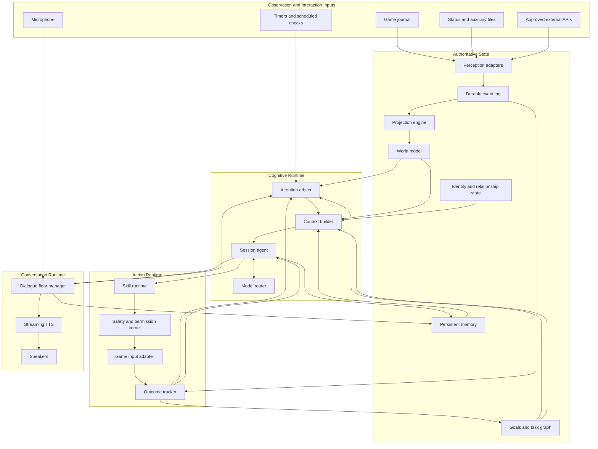

# Greenfield LLM Companion Architecture

**Status:** Conceptual architecture

**Scope:** A new implementation built from scratch

**Product:** A persistent LLM-powered companion for long space flights, exploration, trading, and combat assistance

## 1. Executive Summary

The system should be designed around a continuously existing companion, not around isolated voice commands.

Its central loop is:

> observe the world, maintain shared context, remember relevant experience, pursue a goal, decide whether to speak or act, verify the result, and continue

The LLM is responsible for language understanding, conversational reasoning, planning, explanation, and selecting bounded capabilities. It is not the source of truth, the long-term memory store, the safety authority, or a real-time flight controller.

The architecture is local-first and event-driven. A durable event log feeds a structured world model. Persistent goals, tasks, memories, and relationship state survive application restarts. A session agent receives a deliberately assembled context and may use a bounded multi-step tool loop. All game actions pass through deterministic skills, policy checks, permission checks, and postcondition verification.

The recommended deployment is a modular monolith with isolated execution lanes, not a distributed microservice system.

## 2. Product Definition

The companion is one coherent crew member that can:

- hold a natural conversation over long sessions;
- remember relevant information across days and restarts;
- understand the current game situation without inventing missing facts;
- maintain shared goals and unfinished commitments;
- provide timely, non-intrusive initiative;
- help execute bounded game actions;
- recognize uncertainty and ask for clarification;
- verify whether an action actually succeeded;
- behave consistently across conversation, analysis, and gameplay;
- degrade safely when telemetry, a model, or another dependency is unavailable.

The companion has several operational roles, but one identity:

- **Conversation partner:** social interaction and continuity during long flights.
- **Exploration partner:** expedition tracking, discovery context, scientific narration, and next-step suggestions.
- **Trade copilot:** route and objective tracking, market reasoning, progress monitoring, and bounded assistance.
- **Combat crew member:** threat alerts, tactical summaries, checklist execution, and explicitly authorized commands.

These roles share memory, goals, world state, and identity. They are not separate personalities or disconnected LLM pipelines.

## 3. Non-Goals

The first architecture should explicitly reject the following:

- unrestricted AFK automation;
- frame-by-frame piloting or aiming by an LLM;
- treating a dispatched key press as proof of success;
- allowing the LLM to bypass permissions or safety policy;
- storing the only copy of important state inside model context;
- using a vector database as the authoritative memory store;
- allowing free-form event commentary without an attention policy;
- maintaining separate identities for chat, research, trade, and game queries;
- claiming certainty when telemetry is absent or stale;
- hiding legal or platform-policy constraints behind a technical capability.

If future product requirements include autonomous trading, navigation, or combat, those modes require richer sanctioned telemetry, a separate safety case, and explicit platform-policy approval.

### 3.1 Operating Constraints and Assumptions

The architecture assumes:

- game telemetry is asynchronous, incomplete, and may be delayed, duplicated, reordered, or missing;
- some auxiliary state is available only after the user opens a corresponding game screen;
- keyboard and UI actuation is non-atomic and may fail because the game focus or screen changed;
- the application is local-first and must tolerate slow or unavailable models and external APIs;
- the commander remains present and supervises gameplay;
- platform policy or legal constraints may disable technically possible capabilities;
- latency budgets are defined against versioned reference hardware rather than assumed universally.

These constraints are part of the domain model. They must not be hidden inside prompt instructions.

## 4. Architectural Principles

### 4.1 State lives outside the model

Prompts are temporary views. Goals, tasks, facts, identity, permissions, and memories are durable application data.

### 4.2 The world is event-sourced

Raw observations are preserved in an append-only event log. Current state is a projection that can be rebuilt and tested.

### 4.3 Facts carry evidence and freshness

Every world fact records where it came from, when it was observed, how long it remains valid, and how confident the system is.

### 4.4 The LLM proposes; deterministic code commits

The LLM may interpret, plan, choose a skill, or explain. Deterministic components validate permissions, execute actions, verify outcomes, and persist state changes.

### 4.5 Capabilities are semantic

The agent selects capabilities such as `prepare_for_jump` or `assess_trade_stop`, not raw keyboard sequences.

### 4.6 Every action is a transaction

An action has preconditions, required permission, resource ownership, execution steps, postconditions, a timeout, and an explicit outcome.

### 4.7 Initiative is governed

The system decides whether to interrupt using urgency, relevance, novelty, confidence, conversational timing, and an interruption budget.

### 4.8 Different latency classes use different execution lanes

Safety warnings, conversation, deliberate planning, and memory consolidation must not compete for one model queue or one executor.

### 4.9 One companion means one identity

All domains use the same identity, relationship state, memory policy, and conversational history.

### 4.10 Everything important is replayable

Recorded observations must be sufficient to reproduce projections, task decisions, action outcomes, and evaluation scenarios without launching the game.

The two central invariants are:

> The LLM may propose intent, but only deterministic code may authorize and execute it.

> The companion may claim an action succeeded only after the outcome tracker observes its postcondition.

## 5. System Overview



### 5.1 Trust Boundaries

External telemetry, transcripts, API content, and model output are untrusted inputs. The event and memory stores are authoritative only after schema validation and policy-controlled writes. Model output remains a proposal until deterministic code validates it. The safety kernel is the only component allowed to authorize game input.

### 5.2 End-to-End Decision Flow

For any non-trivial request:

1. An adapter records the user utterance or game observation.
2. Projections update the structured world model.
3. The attention arbiter decides whether a cognitive turn is justified.
4. The context builder selects fresh facts, active tasks, relevant memories, and allowed capabilities.
5. The session agent interprets the situation and may call bounded read tools.
6. A persistent task is created or advanced when the request spans multiple steps.
7. Any proposed action enters the skill runtime and safety kernel.
8. The outcome tracker waits for supporting game evidence.
9. The task advances only from the observed outcome.
10. The companion responds with what is known, what remains uncertain, and what happens next.

## 6. Authoritative State Layer

### 6.1 Perception Adapters

Each external source has an adapter that translates source-specific data into normalized observations.

Examples:

- journal events;
- status snapshots;
- cargo, market, route, and navigation files;
- microphone transcripts;
- approved third-party data;
- application timers;
- action execution feedback.

Adapters do not decide what an event means for the companion. They validate shape, add source metadata, assign a stable identifier, and publish an `ObservedEvent`.

### 6.2 Durable Event Log

The event log is the immutable history of what the system observed.

An event should contain at least:

| Field | Meaning |
|---|---|
| `eventId` | Stable unique identifier |
| `eventType` | Normalized event type |
| `source` | Originating adapter |
| `observedAt` | Local observation time |
| `sourceTime` | Time reported by the source, if available |
| `sessionId` | Game or application session |
| `correlationId` | Related task, action, or conversation |
| `causationId` | Observation or operation that caused this event |
| `sourceSequence` | Ordering information when the source provides it |
| `payload` | Typed event data |
| `schemaVersion` | Version used to decode the event |

The event log allows:

- crash recovery;
- deterministic replay;
- rebuilding projections after a schema change;
- debugging incorrect decisions;
- correlating an action with later game evidence;
- evaluating new models against old sessions.

### 6.3 Projection Engine and World Model

The projection engine converts observations into a coherent `WorldModel`.

The world model should contain structured entities such as:

- commander and active ship;
- location, star system, body, station, and settlement;
- navigation target and plotted route;
- fuel, hull, shields, heat, cargo, and modules;
- current UI context;
- active missions and expedition objectives;
- trade plan and current trade stop;
- known threats and recent combat events;
- available capabilities and their readiness.

Every projected fact includes:

| Field | Meaning |
|---|---|
| `value` | Current structured value |
| `observedAt` | Last supporting observation |
| `validUntil` | Freshness boundary |
| `source` | Supporting source |
| `confidence` | Confidence in the interpretation |
| `evidence` | References to source events |
| `status` | `KNOWN`, `STALE`, `CONFLICTED`, or `UNKNOWN` |

The context builder must never silently present stale or conflicted facts as current truth.

## 7. Companion Identity and Relationship

The companion has a single durable identity represented by application state, not only by prompt text.

### 7.1 Companion Profile

The profile defines stable characteristics:

- name and voice;
- role aboard the ship;
- values and behavioral boundaries;
- conversational style;
- degree of humor and formality;
- how disagreement and uncertainty are expressed;
- rules for emotional language;
- default initiative policy.

The profile should be versioned and intentionally changed. The LLM must not invent a conflicting biography.

### 7.2 Relationship State

Relationship state records explicit, observable continuity:

- preferred form of address;
- communication preferences;
- established boundaries;
- recurring interests;
- shared milestones;
- trusted routines;
- unresolved disagreements;
- promises and commitments.

This state should not be a hidden numerical imitation of human emotion. It should be explainable and grounded in actual interaction.

## 8. Memory Architecture

Memory is divided by purpose rather than stored as one transcript.

| Memory type | Purpose | Example |
|---|---|---|
| Working | Immediate conversational context | The current topic and unresolved reference |
| Episodic | Significant shared events | First discovery of an Earth-like world |
| Semantic | Stable facts | The commander prefers neutron routes |
| Relationship | Interaction preferences and boundaries | Avoid commentary during docking |
| Commitment | Promises and pending follow-ups | Revisit the expedition budget after arrival |
| Task | Active and historical task state | Trade objective is partially completed |
| Procedural | Curated domain knowledge | Safe preparation checklist for a jump |

### 8.1 Memory Write Policy

Not every turn becomes long-term memory. A deterministic policy creates candidates based on:

- explicit save requests;
- durable preferences;
- commitments;
- meaningful milestones;
- repeated behavior;
- facts likely to matter later.

The LLM may propose a memory candidate, but application code validates its type, evidence, sensitivity, and retention policy.

### 8.2 Retrieval

Retrieval combines:

- structured lookup for profile, goals, and commitments;
- recency for current conversation;
- semantic search for relevant episodes;
- entity and time filters;
- importance and confidence;
- contradiction detection.

Vector search is a derived index. It can be rebuilt from authoritative memory records.

### 8.3 Consolidation and Forgetting

A background process may summarize related episodes, but must preserve links to source records. Summaries never replace the only copy of evidence.

Forgetting is explicit:

- short-lived details expire;
- superseded facts remain historical but no longer current;
- sensitive information follows a retention policy;
- the user can inspect and delete stored memories.

## 9. Goals and Persistent Task Graph

A long-running activity is represented as a task graph, not inferred repeatedly from chat history.

```text
Goal
 ├─ desired outcome
 ├─ owner and autonomy policy
 ├─ current phase
 ├─ completed steps
 ├─ pending steps
 ├─ dependencies
 ├─ required confirmations
 ├─ supporting evidence
 ├─ failure and recovery policy
 └─ completion criteria
```

Tasks survive application restarts and can be paused, resumed, cancelled, or replanned.

Typical task states are:

```text
DRAFT -> READY -> ACTIVE -> WAITING_FOR_WORLD
                       \-> WAITING_FOR_USER
                       \-> BLOCKED
                       \-> COMPLETED
                       \-> FAILED
                       \-> CANCELLED
```

Only observed evidence can advance a task from an attempted action to a completed step.

## 10. Attention and Initiative

Every possible intervention is submitted to the `AttentionArbiter`.

Inputs include:

- safety severity;
- relevance to an active goal;
- novelty;
- confidence;
- time sensitivity;
- current dialogue state;
- whether the commander is already busy;
- recent number of interruptions;
- user preferences;
- whether an intervention requires action or only narration.

The result is one of:

- `INTERRUPT_NOW`;
- `SPEAK_WHEN_FREE`;
- `QUEUE_FOR_BRIEFING`;
- `UPDATE_TASK_SILENTLY`;
- `ASK_FOR_PERMISSION`;
- `IGNORE`.

Hard safety rules are deterministic. An LLM may help rank non-critical candidates, but it cannot suppress mandatory warnings or bypass an interruption budget.

This component creates useful initiative without turning every journal event into dialogue.

## 11. Session Agent

The `SessionAgent` is the only conversational identity presented to the user.

### 11.1 Context Builder

For each turn, the context builder selects:

- companion profile and relationship boundaries;
- current dialogue and turn-taking state;
- active goals and task steps;
- relevant fresh world facts;
- retrieved memories with evidence;
- available tools and permissions;
- unresolved action outcomes;
- response length and urgency constraints.

The context is a deliberate projection, not a dump of all known data.

### 11.2 Bounded Tool Loop

A deliberate turn may perform several tool calls:

```text
understand intent
    -> inspect relevant state
    -> retrieve memory if needed
    -> create or update a task
    -> select a skill
    -> receive skill outcome
    -> re-evaluate
    -> respond
```

The loop has explicit limits:

- maximum steps;
- maximum elapsed time;
- maximum model tokens;
- allowed tool classes;
- cancellation on new urgent input;
- one controlled schema-repair attempt;
- deterministic fallback on model failure.

Tool results return to the agent. A skill dispatch result is never represented as successful completion unless postconditions were observed.

### 11.3 Model Router

Different models may be used without creating different personalities:

- a small local model for classification and simple phrasing;
- a stronger reasoning model for planning;
- an embedding model for retrieval;
- deterministic templates for urgent warnings;
- optional remote models when explicitly configured.

All models receive context from the same state layer and act through the same policy boundary.

Every decision trace records the model, model configuration, prompt version, tool schema version, and context-builder version. A model or prompt upgrade is released only after replay comparison against the current production baseline.

## 12. Skill and Action Runtime

### 12.1 Capability Types

Capabilities are separated into:

- **Read tools:** inspect world state, task state, or approved external data.
- **Reasoning tools:** calculate routes, compare options, or evaluate risk.
- **Dialogue tools:** ask, explain, summarize, or create a briefing.
- **Action skills:** perform bounded game interactions.

The LLM sees only capabilities relevant to the current world state and permission level.

### 12.2 Action Contract

Every action skill defines:

| Contract part | Responsibility |
|---|---|
| Preconditions | Required fresh state |
| Risk class | Safety impact |
| Permission | Required autonomy or confirmation |
| Resources | Input devices or UI contexts owned by the action |
| Execution | Deterministic steps |
| Postconditions | Evidence that proves success |
| Timeout | Maximum wait for evidence |
| Recovery | Retry, compensation, or safe abort |
| Result | `SUCCEEDED`, `FAILED`, `UNKNOWN`, or `CANCELLED` |

### 12.3 Outcome Tracker

The outcome tracker correlates later observations with an active action transaction.

The action lifecycle is explicit:

```text
PROPOSED
  -> AUTHORIZED
  -> DISPATCHED
  -> WAITING_FOR_EVIDENCE
  -> SUCCEEDED | FAILED | UNKNOWN | CANCELLED
```

Each transaction has an idempotency key and a recovery checkpoint. After a restart, the runtime inspects evidence before deciding whether an interrupted action may be retried.

For example:

```text
request docking
    -> dispatch the approved input
    -> wait for a docking-request response event
    -> classify the response
    -> update the task
    -> tell the user what actually happened
```

If evidence is missing, the result is `UNKNOWN`, not success.

## 13. Safety and Permission Kernel

Safety is a deterministic owner layer between cognition and game input.

### 13.1 Autonomy Levels

Permissions are explicit and domain-specific:

| Level | Behavior |
|---|---|
| `OBSERVE_ONLY` | Read and describe |
| `ADVISE` | Recommend but do not act |
| `ASSIST` | Execute reversible low-risk actions allowed by policy |
| `EXECUTE_CONFIRMED` | Execute a specific action after confirmation |

There is no implicit unrestricted mode.

A user may allow exploration assistance while keeping trade and combat at `ADVISE`.

### 13.2 Mandatory Checks

Before execution, the kernel checks:

- capability availability;
- policy and legal restrictions;
- freshness of preconditions;
- confirmation validity and scope;
- concurrent resource ownership;
- whether the game UI is in the expected state;
- cancellation or interruption;
- rate limits and retry limits.

High-risk actions use scoped, expiring confirmations. A confirmation for one action cannot authorize another.

## 14. Voice and Turn-Taking

Voice interaction is a stateful full-duplex subsystem.

It should provide:

- acoustic echo cancellation;
- voice activity detection;
- streaming speech recognition;
- streaming speech synthesis;
- explicit dialogue-floor ownership;
- natural barge-in;
- urgent interruption support;
- playback progress and cancellation;
- delivery-aware conversation records.

Assistant output has separate states:

```text
GENERATED -> QUEUED -> SPEAKING -> DELIVERED
                         \-> INTERRUPTED
                         \-> FAILED
```

The conversational record distinguishes what was generated from what the commander actually heard. Interrupted output is not silently treated as a completed exchange.

## 15. Execution Lanes and Concurrency

The runtime has four isolated lanes:

| Lane | Typical work | Target behavior |
|---|---|---|
| Reflex | Critical warnings, cancellation, input safety | Deterministic and immediate |
| Interactive | Conversation and simple read tools | Low latency, streaming response |
| Deliberate | Multi-step planning and task revision | Bounded but allowed to take longer |
| Background | Memory consolidation, indexing, replay analysis | Preemptible and lowest priority |

The reflex lane never waits behind an LLM request. Background work cannot consume the only model slot required by conversation.

Semantic actions use resource locks such as:

- `PRIMARY_INPUT`;
- `NAVIGATION_UI`;
- `GALAXY_MAP`;
- `COMBAT_CONTROLS`;
- `SPEECH_OUTPUT`.

This prevents individually valid skills from interfering with one another.

Every lane has a bounded queue, item time-to-live, backpressure policy, and cancellation propagation. Runtime generations fence off late results from a cancelled or replaced session.

## 16. Domain Behavior

### 16.1 Long-Flight Conversation

The companion should:

- preserve topics and commitments across interruptions;
- remember meaningful facts after restart;
- use the current journey as conversational context;
- distinguish silence from loss of context;
- prepare queued briefings rather than interrupting repeatedly;
- ask before storing sensitive personal information.

Conversation is not a fallback after failing to identify a command. It is a first-class activity with its own goals and turn state.

### 16.2 Exploration

An exploration goal may include:

- destination or region;
- systems and bodies already assessed;
- scan completion criteria;
- biological targets;
- discoveries worth remembering;
- fuel and route constraints;
- planned stops;
- an expedition journal.

The companion updates progress from observations, suggests the next meaningful action, and produces briefings from structured evidence.

### 16.3 Trading

A trade task records:

- commodity;
- requested quantity;
- source and destination;
- current cargo related to the task;
- expected cost and revenue;
- completed quantity;
- partial fills;
- market freshness;
- route changes;
- permission required for each action.

Unrelated cargo must not change the interpretation of the task. If price, stock, cargo, or route changes, the task is replanned from current evidence.

### 16.4 Combat

Combat uses two layers:

1. A deterministic reflex layer for urgent alerts and safe pre-approved actions.
2. An LLM tactical layer for summaries, recommendations, checklists, and explanations.

The LLM does not control pitch, yaw, roll, aiming, or firing frame by frame. Such control requires a dedicated real-time controller, high-frequency sanctioned telemetry, a separate safety design, and explicit platform-policy approval.

## 17. Persistence and Local Deployment

The recommended deployment is a single local application with strongly separated modules and worker pools.

A practical storage layout is:

- SQLite in WAL mode for events, world projections, tasks, memories, identity, and action transactions;
- an embedded full-text and vector index as rebuildable derived data;
- versioned schemas and forward migrations;
- encrypted storage for sensitive user data and credentials;
- periodic consistent backups;
- explicit export and deletion controls.

Suggested logical modules:

```text
companion-domain
perception
event-store
world-model
identity
memory
goals-and-tasks
attention
session-agent
model-gateway
skills
safety
voice
observability
replay-and-evaluation
desktop-app
```

Module boundaries are contracts. They do not require separate operating-system processes.

## 18. Failure Behavior

Failure handling is part of the normal design.

| Failure | Required behavior |
|---|---|
| LLM timeout | Cancel the turn, preserve task state, use a concise fallback |
| Invalid tool call | Attempt one schema repair, then fail safely |
| Model unavailable | Keep deterministic warnings and read-only status available |
| Stale telemetry | State uncertainty and avoid dependent actions |
| Lost or reordered event | Detect sequence gaps where possible and mark affected projections uncertain |
| Duplicate event | Deduplicate by source identity and make projection updates idempotent |
| Action outcome missing | Return `UNKNOWN`; never claim success |
| Restart during execution | Recover the transaction and inspect evidence before retrying |
| Queue overload | Apply backpressure, discard expired low-priority work, preserve reflex capacity |
| Application crash | Recover event log, task state, and active transactions |
| TTS interruption | Mark undelivered text and preserve the dialogue floor |
| Memory conflict | Retain both claims, mark conflict, and request clarification when relevant |
| Storage corruption | Stop mutations, expose degraded status, and restore from a verified backup |
| External API failure | Continue from local state with explicit freshness information |
| Untrusted external text | Treat it as data, isolate it from instructions, and restrict reachable tools |
| Model or prompt regression | Roll back the version after replay and production-metric comparison |
| New urgent event | Preempt deliberate work without corrupting its task |

## 19. Observability and Evaluation

Every user-visible decision should have a correlation trace:

```text
input
 -> selected world facts
 -> retrieved memories
 -> active goal
 -> model request
 -> tool calls
 -> permission decision
 -> action transaction
 -> observed outcome
 -> spoken response
```

Prompts and traces must support redaction and configurable retention.

### 19.1 Replay Tests

Recorded sessions should cover:

- a multi-hour exploration journey;
- restart during an active task;
- partial trade completion;
- stale and conflicting data;
- rapid combat events during an LLM request;
- interrupted speech;
- model timeout and malformed output;
- corrections to remembered information;
- 100 or more conversational turns;
- several days of simulated continuity.

### 19.2 Release Metrics

Initial release gates should include:

| Dimension | Release expectation |
|---|---|
| Action truthfulness | Every success claim has a matching postcondition |
| Safety | No action outside its configured autonomy level |
| Restart continuity | Active goals and accepted memories survive restart |
| Grounding | Stale or unknown facts are qualified, not presented as current |
| Persona consistency | One identity across conversation and all domains |
| Initiative quality | Proactive interventions are useful and respect interruption limits |
| Recoverability | Interrupted tasks resume without reconstructing state from chat |
| Reflex latency | Critical deterministic warnings meet a defined local latency budget |
| Conversation latency | Speech begins within a defined budget and streams when possible |
| Privacy | Stored memories are inspectable, exportable, and deletable |

Human evaluation is required for companionship quality. Structural tests alone cannot measure trust, naturalness, annoyance, or relationship continuity.

## 20. Open Decisions

The architecture intentionally leaves several product decisions open:

- the minimum supported reference hardware and latency budgets;
- the default local model and optional remote-model policy;
- which game capabilities are permitted by platform policy;
- the maximum autonomy level allowed in each domain;
- the retention period and encryption policy for personal memories;
- how users inspect, correct, export, and delete relationship state;
- which proactive behaviors are enabled by default;
- whether multiple commanders or game profiles share one companion identity;
- which action skills can recover safely after application or game restart.

These decisions should be captured as versioned architecture decision records before implementation.

## 21. Recommended Delivery Order

This is a greenfield implementation order, not a migration plan:

1. Event log, replay harness, and structured world model.
2. Persistent identity, memory, goals, and task graph.
3. Session agent, context builder, and bounded read-only tool loop.
4. Voice floor management and delivery-aware conversation.
5. Exploration companion as the first complete vertical product.
6. Trade copilot with persistent, evidence-driven workflows.
7. Bounded action skills with outcome verification.
8. Combat advisory and deterministic reflex support.
9. Any higher autonomy only after telemetry, safety, and policy requirements are independently satisfied.

Exploration is the preferred first domain because it naturally exercises long-session memory, shared goals, initiative, and rich narration while carrying less risk than autonomous trade or combat.

## 22. Final Architectural Position

The system should be built around three durable objects:

1. **A world model** describing what is currently believed and why.
2. **A relationship and memory model** describing what has been shared and retained.
3. **A goal and task model** describing what the commander and companion are doing together.

The LLM operates over those objects but does not replace them.

A successful companion is therefore not a larger prompt attached to a command router. It is a persistent agent runtime in which language, memory, goals, attention, skills, permissions, and verified outcomes form one continuous loop.
